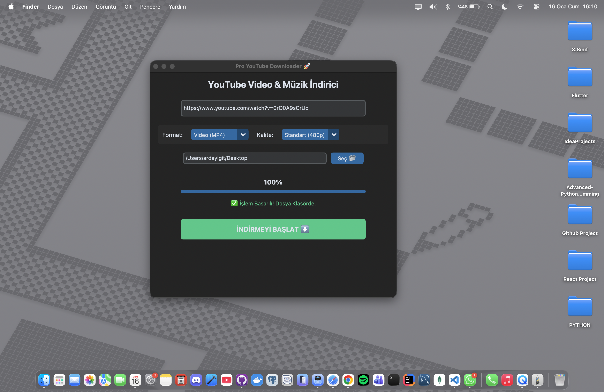

<div align="center">
  <h1>📺 Pro YouTube Downloader GUI</h1>
  
  <p>
    <strong>Modern, Hızlı ve Kullanıcı Dostu Video İndirme Aracı</strong>
  </p>

  <p>
    <a href="https://www.python.org/">
      
    </a>
    <a href="https://github.com/TomSchimansky/CustomTkinter">
      
    </a>
    <a href="https://github.com/yt-dlp/yt-dlp">
      
    </a>
  </p>
</div>

---

## 🚀 Proje Hakkında

**Pro YouTube Downloader**, Python ve `CustomTkinter` kütüphanesi kullanılarak geliştirilmiş, modern arayüze (GUI) sahip gelişmiş bir indirme aracıdır. Standart indiricilerin aksine, kullanıcıya **dosya formatı seçme**, **indirme konumu belirleme** ve **canlı ilerleme takibi** gibi profesyonel özellikler sunar.

> **Not:** `yt-dlp` altyapısı sayesinde YouTube'un sürekli değişen algoritmalarına karşı dayanıklıdır ve yüksek kalitede (Ses+Görüntü) indirme yapar.

---

## ✨ Temel Özellikler

* **🎨 Modern Arayüz:** Windows 11 tarzı estetik, karanlık mod (Dark Mode) tasarımı.
* **📊 Canlı İlerleme Çubuğu:** İndirme durumunu % (yüzde) ve progress bar üzerinden anlık takip.
* **📂 Konum Seçimi:** Dosyaların nereye kaydedileceğini (Masaüstü, İndirilenler vb.) seçebilme özgürlüğü.
* **🎵 Format Seçenekleri:** İster video (MP4), ister sadece ses (MP3) olarak indirme imkanı.
* **🔊 Ses Sorunu Çözümü:** Yüksek kaliteli videolarda yaşanan "ses gelmeme" sorunu özel algoritmalarla çözülmüştür.
* **⚡ Donmayan Yapı:** `Threading` mimarisi sayesinde indirme yaparken program kilitlenmez.

---

## 🛠️ Kurulum

Projeyi bilgisayarınızda çalıştırmak için aşağıdaki adımları izleyin:

**1. Projeyi Klonlayın**
```bash
git clone [https://github.com/KULLANICI_ADIN/youtube-downloader-gui.git](https://github.com/KULLANICI_ADIN/youtube-downloader-gui.git)
cd youtube-downloader-gui
```

**2. Gerekli Kütüphaneleri Yükleyin**
```bash
pip install customtkinter yt-dlp
```

**3. Uygulamayı Başlatın**
```bash
python main.py
```
---

## 📸 Ekran Görüntüleri



## 💻 Nasıl Kullanılır?

- 1.Uygulamayı başlatın.
- 2.YouTube video bağlantısını kutucuğa yapıştırın.
- 3.Format seçin (Video veya Sadece Ses).
- 4."Seç 📂" butonu ile dosyayı kaydetmek istediğiniz klasörü belirleyin.
- 5."İNDİRMEYİ BAŞLAT" butonuna basın ve ilerleme çubuğunu izleyin! 🍿

**🔧 Teknik Detaylar (Geliştiriciler İçin)**

- GUI Framework: CustomTkinter (Tkinter üzerine modern wrapper)
- İndirme Motoru: yt-dlp (FFmpeg gerektirmeden en iyi formatı seçer)
- Async İşlemler: Python threading modülü
- SSL Bypass: macOS sertifika sorunları için otomatik nocheckcertificate ayarı içerir.

**👤 Geliştirici**
Arda Yiğit
- [🔗 LinkedIn](https://www.linkedin.com/in/arda-yigit)
- [🐙 GitHub](https://github.com/ygtarda)

---

<div align="center"> <sub>Bu proje eğitim amaçlı geliştirilmiştir.</sub> </div>

